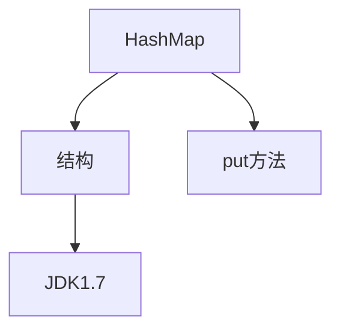

# Map-HashMap源码阅读

HashMap实现了Map接口，允许放入的值的`key`或`value`为`null`，除该类未实现同步外，其余与Hashtable大致相同（Hashtable的方法都有`synchronized`修饰）

HashMap容器`不保证元素顺序`，根据需要可能会对元素`重新哈希`，元素的顺序也会被重新打散，因此不同时间迭代同一个HashMap的顺序可能会不同。并且根据对冲突的处理方式不同，哈希表有两种实现方式，一种开放地址方式(open addressing)，另一种是冲突链表方式(Separate chaining with linked lists)。

在将键值对存入数组之前，将key通过哈希算法计算出哈希值，把`哈希值`作为`数组下标`，把该下标对应的位置作为键值对的存储位置，通过该方法建立的数组叫做`哈希表`，存储位置叫做`桶(bucket)`。数组是通过整数下标直接访问元素，哈希表是通过字符串key直接访问元素，也就说哈希表是一种特殊的数组（关联数组），哈希表广泛应用于实现数据的快速查找（在map的key集合中，一旦存储的key的数量特别多，那么在要查找某个key的时候就会变得很麻烦，数组中的key需要挨个比较，哈希的出现，使得这样的比较次数大大减少。）

## HashMap描述

HashMap的底层是由`数组`、`链表`、`红黑树`（当链表中的节点数量大于等于8的时候，**同时当前数组中的长度大于等于MIN_TREEIFY_CAPACITY时**，链表会转换为红黑树）实现，往HashMap中添加键值对的步骤：通过`取模运算`得到桶数组的坐标；往`链表或红黑树`中添加节点。

对于取模运算，是通过hash&（n-1）实现。hashmap的容量大小是2的幂次方，可以通过&运算来优化%运算。如（17%16）等价于（17&（16-1））。hashmap获取桶数组坐标的时候，会先执行hash（key）运算。

```java
//hash源码
static final int hash(Object key) {
    int h;
    return (key == null) ? 0 : (h = key.hashCode()) ^ (h >>> 16);
}
```

## HashMap的数据结构


```java
transient Node<K,V>[] table;

static class Node<K,V> implements Map.Entry<K,V> {
    final int hash;
    final K key;
    V value;
    Node<K,V> next;

    Node(int hash, K key, V value, Node<K,V> next) {
        this.hash = hash;
        this.key = key;
        this.value = value;
        this.next = next;
    }

    public final K getKey()        { return key; }
    public final V getValue()      { return value; }
    public final String toString() { return key + "=" + value; }

    public final int hashCode() {
        return Objects.hashCode(key) ^ Objects.hashCode(value);
    }

    public final V setValue(V newValue) {
        V oldValue = value;
        value = newValue;
        return oldValue;
    }

    public final boolean equals(Object o) {
        if (o == this)
            return true;
        if (o instanceof Map.Entry) {
            Map.Entry<?,?> e = (Map.Entry<?,?>)o;
            if (Objects.equals(key, e.getKey()) &&
                Objects.equals(value, e.getValue()))
                return true;
        }
        return false;
    }
}
```


## 数据常量

```java
//HashMap的初始容量大小；容量必须是2的幂次方倍数
static final int DEFAULT_INITIAL_CAPACITY = 1 << 4; // aka 16  1*2^4=16

//最大容量，如果一个更高的值由任何一个带参数的构造函数隐式指定时使用。必须是 2 <= 1<<30 的幂。
static final int MAXIMUM_CAPACITY = 1 << 30;

//负载因子大小
static final float DEFAULT_LOAD_FACTOR = 0.75f;

//使用树而不是列表的 bin 计数阈值。将元素添加到至少具有这么多节点的 bin 时，bin 将转换为树。
//该值必须大于 2 并且应该至少为 8，以便与树移除中关于在收缩时转换回普通 bin 的假设相吻合。
//从链表变为树的一个阈值
static final int TREEIFY_THRESHOLD = 8;

//在调整大小操作期间 untreeifying（拆分）bin 的 bin 计数阈值。
//应小于 TREEIFY_THRESHOLD，并且最多 6 以在移除时进行收缩检测。
//从树化变为链化的条件。当树化的元素小于6则进行链化
static final int UNTREEIFY_THRESHOLD = 6;

//可对其进行树化的 bin 的最小表容量。 （否则，如果 bin 中有太多节点，则调整表的大小。）
//应至少为 4 TREEIFY_THRESHOLD 以避免调整大小和树化阈值之间的冲突。
static final int MIN_TREEIFY_CAPACITY = 64;
```

## 构造方法

```java
//无参构造方法；构造一个具有默认初始容量 (16) 和默认加载因子 (0.75) 的空 HashMap。
//只设置了负载因子，并没有进行数组的初始化
public HashMap() {
    this.loadFactor = DEFAULT_LOAD_FACTOR; // all other fields defaulted
}

//有参构造方法
public HashMap(int initialCapacity) {
    //构造自定义容量大小，默认负载因子的HashMap
    this(initialCapacity, DEFAULT_LOAD_FACTOR);
}    

public HashMap(int initialCapacity, float loadFactor) {
    //判断设置的容量大小是否合理
    if (initialCapacity < 0)
        throw new IllegalArgumentException("Illegal initial capacity: " +
                                           initialCapacity);
    //设置的容量大小超过了最大值，就用默认的最大值
    if (initialCapacity > MAXIMUM_CAPACITY)
        initialCapacity = MAXIMUM_CAPACITY;
    //负载因子是否规范
    if (loadFactor <= 0 || Float.isNaN(loadFactor))
        throw new IllegalArgumentException("Illegal load factor: " +
                                           loadFactor);
    this.loadFactor = loadFactor;
    this.threshold = tableSizeFor(initialCapacity);
}

//返回给定目标容量的二次方
static final int tableSizeFor(int cap) {
    int n = cap - 1;
    n |= n >>> 1;
    n |= n >>> 2;
    n |= n >>> 4;
    n |= n >>> 8;
    n |= n >>> 16;
    return (n < 0) ? 1 : (n >= MAXIMUM_CAPACITY) ? MAXIMUM_CAPACITY : n + 1;
}

public HashMap(Map<? extends K, ? extends V> m) {
    this.loadFactor = DEFAULT_LOAD_FACTOR;
    putMapEntries(m, false);
}
```

## 链表转红黑树

HashMap采用链表法来解决哈希冲突HashMap原理，即具有相同桶下标的键值对使用一个链表来存储。但是当链表变长时，查找和添加（需要确定key是否存在）都需要遍历这个链表，速度会非常慢。JDK1.8引入了链表转换为红黑树的机制，只有在链表节点个数大于等于`TREEIFY_THRESHOLD`时、并且数组中的长度大于等于`MIN_TREEIFY_CAPACITY`时，链表中的所有节点才会转化成红黑树。

红黑树是一种高级的平衡二叉树结构，其能保证查找、插入、删除的时间复杂度最坏为O(logn)。在大数据量的场景下，相比于AVL树，红黑树的插入删除性能要更高。当链表中的节点数量大于等于8的时候，**同时当前数组中的长度大于等于MIN_TREEIFY_CAPACITY时**，链表中的所有节点会被转化成红黑树，而如果当前链表节点的数量小于等于6的时候，红黑树又会被退化成链表。

### put过程

```java
public V put(K key, V value) {
    return putVal(hash(key), key, value, false, true);
}

// 第四个参数 onlyIfAbsent 如果是 true，那么只有在不存在该 key 时才会进行 put 操作
final V putVal(int hash, K key, V value, boolean onlyIfAbsent,
               boolean evict) {
    Node<K,V>[] tab; Node<K,V> p; int n, i;
    
 	// 第一次 put 值的时候，会触发下面的 resize()，类似 java7 的第一次 put 也要初始化数组长度
    // 第一次 resize 和后续的扩容有些不一样，因为这次是数组从 null 初始化到默认的 16 或自定义的初始容量
    if ((tab = table) == null || (n = tab.length) == 0)
        n = (tab = resize()).length;
    // 找到具体的数组下标，如果此位置没有值，那么直接初始化一下 Node 并放置在这个位置就可以了
    if ((p = tab[i = (n - 1) & hash]) == null)
        //初始化链表
        tab[i] = newNode(hash, key, value, null);
    else {
        //数组中该位置已经有数据了
        Node<K,V> e; K k;
        //首先，判断该位置的第一个数据和要插入的数据，key是不是“相等”，是则取出该节点。利用hash值和equals判断key是不是“相等”
        if (p.hash == hash &&
            ((k = p.key) == key || (key != null && key.equals(k))))
            e = p;
        //如果该节点是红黑树的节点，则调用红黑树的插值方法
        else if (p instanceof TreeNode)
            e = ((TreeNode<K,V>)p).putTreeVal(this, tab, hash, key, value);
        //代表该位置是一个链表
        else {
            //对链表进行循环
            for (int binCount = 0; ; ++binCount) {
                if ((e = p.next) == null) {
                    //将数据插入到链表的最后（java7是插入到链表的最前面）
                    p.next = newNode(hash, key, value, null);
                    //判断数据插入后，链表的个数是否超过链表转红黑树的界限值（8）
                    if (binCount >= TREEIFY_THRESHOLD - 1) // -1 for 1st
                        treeifyBin(tab, hash);	//链表中的节点数量大于等于TREEIFY_THRESHOLD时，调用treeifyBin方法
                    break;
                }
                //如果在链表中找到了“相等”的key（==或equals）
                if (e.hash == hash &&
                    ((k = e.key) == key || (key != null && key.equals(k))))
                    // 此时 break，那么 e 为链表中[与要插入的新值的 key "相等"]的 node
                    break;
                p = e;
            }
        }
        //此时e不为空，说明存在旧值的key与要插入的key相等
        if (e != null) { // existing mapping for key
            //用要插入的value将存在的key的value覆盖
            V oldValue = e.value;
            if (!onlyIfAbsent || oldValue == null)
                e.value = value;
            afterNodeAccess(e);
            return oldValue;
        }
    }
    ++modCount;
    //如果hashmap由于新插入的值导致size已经超过阈值，则需要进行扩容。
    if (++size > threshold)
        resize();
    afterNodeInsertion(evict);
    return null;
} 
```

### treeifyBin

```java
final void treeifyBin(Node<K,V>[] tab, int hash) {
    int n, index; Node<K,V> e;
    //将数组的长度与MIN_TREEIFY_CAPACITY比较
    if (tab == null || (n = tab.length) < MIN_TREEIFY_CAPACITY)
        //数组长度（桶的个数）小于MIN_TREEIFY_CAPACITY会优先扩容
        resize();
    else if ((e = tab[index = (n - 1) & hash]) != null) {
        TreeNode<K,V> hd = null, tl = null;
        do {
            TreeNode<K,V> p = replacementTreeNode(e, null);
            if (tl == null)
                hd = p;
            else {
                p.prev = tl;
                tl.next = p;
            }
            tl = p;
        } while ((e = e.next) != null);
        if ((tab[index] = hd) != null)
            hd.treeify(tab);
    }
}
```

### resize链表扩容

用于存放key值得的数组桶的长度是固定的，由初始化决定。因此，随着数据的插入数量增加以及负载因子的作用下，需要扩容来存放更多的数据。在jdk1.8中的扩容机制中，可以不需要再重新计算每一个元素的哈希值。

```java
final Node<K,V>[] resize() {
    Node<K,V>[] oldTab = table;
    int oldCap = (oldTab == null) ? 0 : oldTab.length;
    int oldThr = threshold;
    int newCap, newThr = 0;
    //如果容量不为空，说明已经初始化
    if (oldCap > 0) {
        //如果容量达到了最大容量1<<30则不再扩容
        if (oldCap >= MAXIMUM_CAPACITY) {
            threshold = Integer.MAX_VALUE;
            return oldTab;
        }
        //按旧容量和阈值的2倍计算新容量和阈值
        else if ((newCap = oldCap << 1) < MAXIMUM_CAPACITY &&
                 oldCap >= DEFAULT_INITIAL_CAPACITY)
            newThr = oldThr << 1; // double threshold
    }
    else if (oldThr > 0) // initial capacity was placed in threshold
        // 初始化时，将 threshold 的值赋值给 newCap，
        // HashMap 使用 threshold 变量暂时保存 initialCapacity 参数的值
        newCap = oldThr;
    else {               // zero initial threshold signifies using defaults
        // 调用无参构造方法时，数组桶数组容量为默认容量 1 << 4; aka 16
        // 阀值；是默认容量与负载因子的乘积，0.75
        newCap = DEFAULT_INITIAL_CAPACITY;
        newThr = (int)(DEFAULT_LOAD_FACTOR * DEFAULT_INITIAL_CAPACITY);
    }
    // newThr为0，则使用阀值公式计算容量
    if (newThr == 0) {
        float ft = (float)newCap * loadFactor;
        newThr = (newCap < MAXIMUM_CAPACITY && ft < (float)MAXIMUM_CAPACITY ?
                  (int)ft : Integer.MAX_VALUE);
    }
    threshold = newThr;
    @SuppressWarnings({"rawtypes","unchecked"})
    //初始化数据桶，用于存放key
    Node<K,V>[] newTab = (Node<K,V>[])new Node[newCap];
    table = newTab;
    if (oldTab != null) {
        //如果旧数组桶，oldCap有值，则遍历将键值映射到新数组桶中
        for (int j = 0; j < oldCap; ++j) {
            Node<K,V> e;
            if ((e = oldTab[j]) != null) {
                oldTab[j] = null;
                if (e.next == null)
                    newTab[e.hash & (newCap - 1)] = e;
                else if (e instanceof TreeNode)
                    //split，红黑树的拆分操作。在重新映射时进行操作。
                    ((TreeNode<K,V>)e).split(this, newTab, j, oldCap);
                else { // preserve order
                    Node<K,V> loHead = null, loTail = null;
                    Node<K,V> hiHead = null, hiTail = null;
                    Node<K,V> next;
                    do {
                        next = e.next;
                        if ((e.hash & oldCap) == 0) {
                            if (loTail == null)
                                loHead = e;
                            else
                                loTail.next = e;
                            loTail = e;
                        }
                        else {
                            if (hiTail == null)
                                hiHead = e;
                            else
                                hiTail.next = e;
                            hiTail = e;
                        }
                    } while ((e = next) != null);
                    if (loTail != null) {
                        loTail.next = null;
                        newTab[j] = loHead;
                    }
                    if (hiTail != null) {
                        hiTail.next = null;
                        newTab[j + oldCap] = hiHead;
                    }
                }
            }
        }
    }
    return newTab;
}
```

## get过程

```java
public V get(Object key) {
    Node<K,V> e;
    return (e = getNode(hash(key), key)) == null ? null : e.value;
}

final Node<K,V> getNode(int hash, Object key) {
    Node<K,V>[] tab; Node<K,V> first, e; int n; K k;
    if ((tab = table) != null && (n = tab.length) > 0 &&
        (first = tab[(n - 1) & hash]) != null) {
        //判断第一个节点是不是就是需要的
        if (first.hash == hash && // always check first node
            ((k = first.key) == key || (key != null && key.equals(k))))
            return first;
        if ((e = first.next) != null) {
            //判断是不是红黑树
            if (first instanceof TreeNode)
                return ((TreeNode<K,V>)first).getTreeNode(hash, key);
            //链表遍历
            do {
                if (e.hash == hash &&
                    ((k = e.key) == key || (key != null && key.equals(k))))
                    return e;
            } while ((e = e.next) != null);
        }
    }
    return null;
}

```

## 总结



<iframe id="embed_dom" name="embed_dom" frameborder="0" style="display:block;width:525px; height:245px;" src="https://www.processon.com/embed/62d22f307d9c08119ce25233"></iframe>

